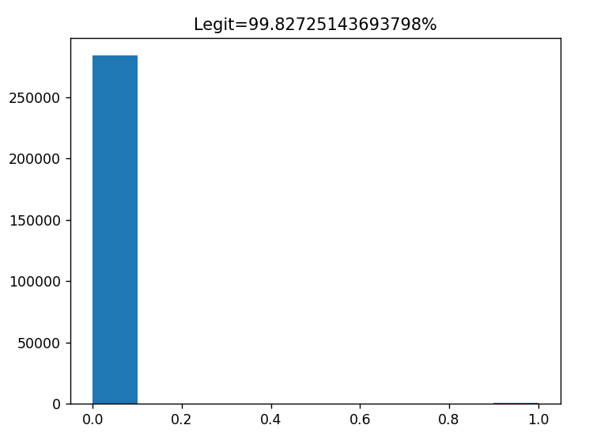
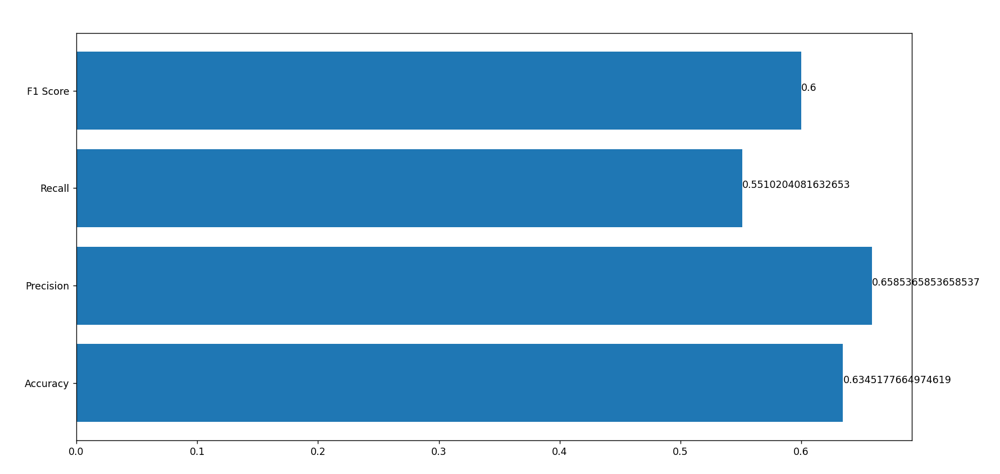
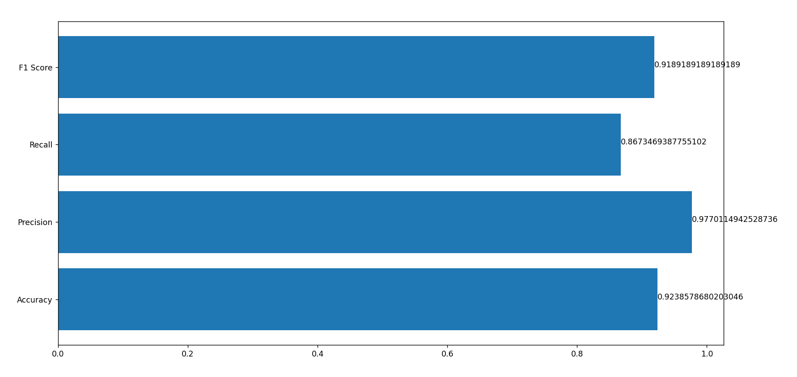
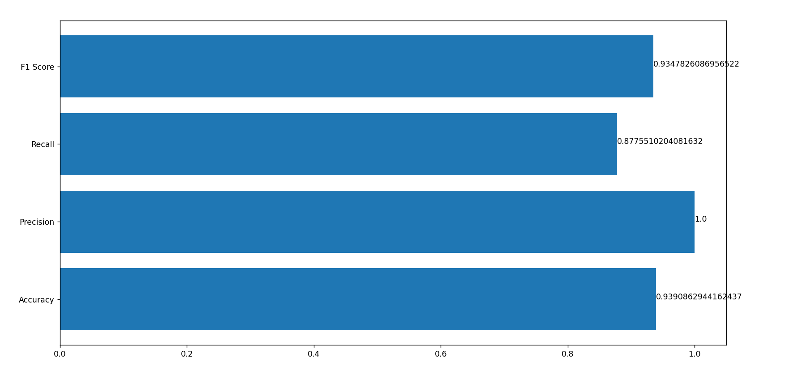
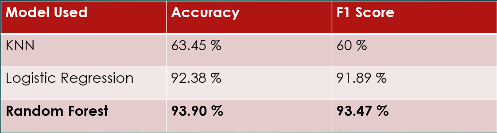

# Credit Card Fraud Detection

## Description

Performed analysis on an imbalanced PCA dataset, utilizing **K-Nearest Neighbors (KNN)**, **Random Forest**, and **Logistic Regression** algorithms to classify transactions as legitimate or fraudulent. Achieved remarkable results by employing Random Forest, attaining an accuracy of **93.9%** and an impressive F1 Score of **93.4%**.

## Is this even an Issue ?

* **65%** of credit and credit card holders have been fraud victims at some point in their lives, up from **58%** last year.

* In 2022, **44%** of credit card users reported having two or more fraudulent charges, compared to **35%** in 2021.

* Since 2021, the median fraudulent charge has climbed by about 27%. This equates to about **$12 billion** in total attempted fraudulent charges.

* A small-but-significant share of people (**12%**) had fraudulent recurring charges from the same merchant over several months.
## How can detection help ?

* ***Quick identification*** of fraudulent transactions can prevent financial loss to the affected parties, such as individuals or businesses. It can also prevent the spread of fraud to other accounts or financial systems.

* By identifying and analyzing fraudulent transactions quickly, financial institutions and businesses can ***gain insight*** into the methods used by fraudsters and take measures to prevent similar attacks in the future.

* Quick identification of fraudulent transactions can lead to ***faster resolution*** of the issue, as it allows for prompt reversal of the transaction and investigation of the fraud.

## Data Analysis
* It was found out that Data is having  **2,84,807** rows and **31** columns.

* Class 1 Signifies **Fraudulent Transaction**
* Class 0 signifies **Legit transaction**

* It was found out that out of **2,84,807** Transactions, only **492** were legit.

* This implies that the data is severely **unbalanced**, and we will have to balance it before training the models.

## Basic Outline to build each Model
* Loading the Data

* Balancing the data

* Splitting the data into Test and Train Dataset

* Tuning the Model

* Evaluating the Model by finding Accuracy, Precision, Recall & F1 Score for the given model

* Pickling the Model

## Models used
* **KNN (K-Nearest Neighbours)**  
  It works by finding the K nearest neighbors to the new instance from the training data and then assigning the class label of the majority of those neighbors to the new instance.

* **Logistic Regression**  
  It models the probability of the target variable taking a particular value based on a set of input features. The output of logistic regression is a probability score between 0 and 1, which can be interpreted as the likelihood of the instance belonging to the positive class.

* **Random Forest**  
  It is an ensemble learning method that combines multiple decision trees to create a more accurate and robust model. Decision Tree is a tree-based model that recursively splits the input data into smaller subsets based on the values of the input features, and makes predictions based on the resulting subsets.

## Evaluating KNN

## Evaluating Logistic Regression

## Evaluating Random Forest

## Issues Faced
* Originally, the accuracy of the model was excellent, but its precision and recall were significantly low. To address this issue, the dataset was **balanced** prior to being inputted into the model.

* The analysis of **feature correlation** proved challenging due to the application of Principal Component Analysis (PCA) on the dataset.

* Since the outcome of K-Nearest Neighbors (KNN) is reliant on the initial value of **K**, the model underwent analysis using various K values before being pickled for future use.

## Conclusion Drawn

Highest Accuracy of **93.90%** was achieved using Random Forest Classifier with an impressive F1 Score of **93.47%**.

